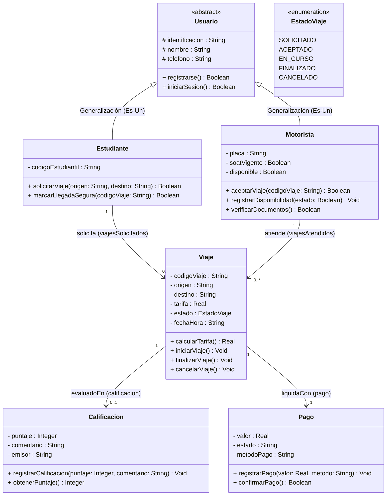

# TucanGo — Diagrama y Modelo de Dominio UML v2.0 (Semana 3)

> **Contexto:** Modelo de Dominio Orientado a Objetos para el sistema de confianza y trazabilidad de movilidad estudiantil en el campus (**TucanGo**).
> **Evolución v1.0 → v2.0:** Alineado con los estándares OMG UML 2.5 y las directrices de la **Semana 3 ("Ecosistemas Digitales: El Arte de Relacionar Clases")** de *Lógica y Algoritmos II (Universidad de la Amazonia)*.

---

## 1. Principales Mejoras y Correcciones Aplicadas (v1.0 vs v2.0)

| Aspecto | Versión v1.0 (Anterior) | Versión v2.0 (Optimizada Semana 3) | Justificación Teórica |
| :--- | :--- | :--- | :--- |
| **Relaciones con `Viaje`** | Composición (`♦`) en imagen / Asociación simple | **Asociaciones Dirigidas (`-->`) limpias** | `Viaje` no puede pertenecer por ciclo de vida estricto a dos dueños simultáneamente. Si un estudiante o motorista se desvincula, los registros históricos de auditoría y pagos deben persistir. |
| **Jerarquía y Herencia** | `Estudiante` y `Motorista` aislados | **Generalización (`Usuario` como clase abstracta/base)** | Aplica el principio DRY y relación *"Es-Un"*. Ambos son actores del sistema con identidad (`id/codigo`, `nombre`, `telefono`). |
| **Sintaxis OMG UML** | Estilo Java (`-String codigo`, `+double calc()`) | **Estilo Formal UML (`- codigo : String`, `+ calc() : Real`)** | Cumple la notación universal de modelado de software. |
| **Regla de Oro (Semana 3)** | Cumplida conceptualmente | **Estrictamente verificada** | Ninguna relación representada por línea se duplica como variable primitiva dentro del cajón de la clase. |
| **Atributos de Control** | Faltaba trazabilidad de estado | **Inclusión de `EstadoViaje` y timestamps** | Permite el ciclo de vida real: `SOLICITADO` -> `EN_CURSO` -> `FINALIZADO` -> `CANCELADO`. |

---

## 2. Diagrama de Clases UML v2.0 (Código Mermaid)



---

## 3. Especificación Detallada de Clases y Responsabilidades

### 3.1 `Usuario` (*Clase Base Abstracta*)
* **Propósito:** Abstraer los atributos y comportamientos comunes de cualquier persona que interactúa en la plataforma.
* **Atributos:**
  * `# identificacion : String` (Cédula o documento base).
  * `# nombre : String` (Nombre completo para seguridad y reconocimiento).
  * `# telefono : String` (Número de contacto para alertas o emergencias).
* **Operaciones:**
  * `+ registrarse() : Boolean`
  * `+ iniciarSesion() : Boolean`

---

### 3.2 `Estudiante` (*Subclase de Usuario*)
* **Propósito:** Actor que demanda transporte seguro dentro o hacia el campus.
* **Atributos Específicos:**
  * `- codigoEstudiantil : String` (Identificador institucional en la Uniamazonia).
* **Operaciones:**
  * `+ solicitarViaje(origen: String, destino: String) : Boolean`
  * `+ marcarLlegadaSegura(codigoViaje: String) : Boolean`
* **Mapeo a Java (Semana 3):**
  * Contiene una colección dinámica para retener sus viajes: `private ArrayList<Viaje> viajesSolicitados;`.

---

### 3.3 `Motorista` (*Subclase de Usuario*)
* **Propósito:** Conductor verificado que presta el servicio de movilidad.
* **Atributos Específicos:**
  * `- placa : String` (Identificador del vehículo).
  * `- soatVigente : Boolean` (Validación de seguridad obligatoria).
  * `- disponible : Boolean` (Estado operativo).
* **Operaciones:**
  * `+ aceptarViaje(codigoViaje: String) : Boolean`
  * `+ registrarDisponibilidad(estado: Boolean) : Void`
  * `+ verificarDocumentos() : Boolean`
* **Mapeo a Java (Semana 3):**
  * Contiene una colección dinámica: `private ArrayList<Viaje> viajesAtendidos;`.

---

### 3.4 `Viaje` (*Entidad Núcleo Transaccional*)
* **Propósito:** Representar el servicio de transporte acordado, su trazabilidad y ciclo de vida.
* **Atributos:**
  * `- codigoViaje : String` (Código único alfanumérico).
  * `- origen : String` (Punto de partida en/fuera de la universidad).
  * `- destino : String` (Punto de llegada).
  * `- tarifa : Real` (Valor monetario pactado bajo reglas de precio justo).
  * `- estado : EstadoViaje` (Enum con estados: `SOLICITADO`, `ACEPTADO`, `EN_CURSO`, `FINALIZADO`, `CANCELADO`).
  * `- fechaHora : String` (Marca temporal de creación).
* **Operaciones:**
  * `+ calcularTarifa() : Real`
  * `+ iniciarViaje() : Void`
  * `+ finalizarViaje() : Void`
  * `+ cancelarViaje() : Void`
* **Mapeo a Java (Semana 3):**
  * Referencias a objetos simples para sus dependencias:
    * `private Calificacion calificacion;` (Relación 1 a 0..1).
    * `private Pago pago;` (Relación 1 a 1).

---

### 3.5 `Calificacion` (*Módulo de Reputación y Confianza*)
* **Propósito:** Registrar la retroalimentación y nivel de servicio de cada trayecto completado.
* **Atributos:**
  * `- puntaje : Integer` (Valoración entera entre 1 y 5).
  * `- comentario : String` (Observaciones cualitativas sobre seguridad y trato).
  * `- emisor : String` (Quién emite el feedback).
* **Operaciones:**
  * `+ registrarCalificacion(puntaje: Integer, comentario: String) : Void`
  * `+ obtenerPuntaje() : Integer`

---

### 3.6 `Pago` (*Formalización Económica*)
* **Propósito:** Controlar el registro y liquidación del valor acordado.
* **Atributos:**
  * `- valor : Real` (Monto a pagar).
  * `- estado : String` (`PENDIENTE`, `PAGADO`, `ANULADO`).
  * `- metodoPago : String` (`EFECTIVO`, `NEQUI`, `DAVIPLATA`).
* **Operaciones:**
  * `+ registrarPago(valor: Real, metodo: String) : Void`
  * `+ confirmarPago() : Boolean`

---

## 4. Tabla de Traducción Arquitectónica: UML a Java 21

| Relación UML | Notación Visual | Implementación en Java | Regla de Inicialización |
| :--- | :--- | :--- | :--- |
| **Herencia (`Usuario` ◁— `Estudiante`)** | Flecha de generalización con triángulo hueco | `public class Estudiante extends Usuario` | Uso de `super(id, nombre, telefono);` en el constructor. |
| **1 a Muchos (`Estudiante` 1 ──> 0..\* `Viaje`)** | Flecha directa con multiplicidad `*` | `private ArrayList<Viaje> viajesSolicitados;` | `this.viajesSolicitados = new ArrayList<>();` en el constructor. |
| **1 a Muchos (`Motorista` 1 ──> 0..\* `Viaje`)** | Flecha directa con multiplicidad `*` | `private ArrayList<Viaje> viajesAtendidos;` | `this.viajesAtendidos = new ArrayList<>();` en el constructor. |
| **1 a 0..1 (`Viaje` 1 ──> 0..1 `Calificacion`)** | Flecha directa con multiplicidad `0..1` | `private Calificacion calificacion;` | Inicializado en `null` hasta que el viaje concluya. |
| **1 a 1 (`Viaje` 1 ──> 1 `Pago`)** | Flecha directa con multiplicidad `1` | `private Pago pago;` | Instanciado o vinculado al crear el viaje. |

---

## 5. Representación Textual / ASCII Art para Bitácora y Exposición

```text
                             +----------------------------------------+
                             |           <<abstract>>                 |
                             |             Usuario                    |
                             +----------------------------------------+
                             | # identificacion : String              |
                             | # nombre : String                      |
                             | # telefono : String                    |
                             +----------------------------------------+
                             | + registrarse() : Boolean              |
                             | + iniciarSesion() : Boolean            |
                             +----------------------------------------+
                                                 ▲
                                                / \  (Generalización / Herencia)
                                               +---+
                                                 |
                       +-------------------------+-------------------------+
                       |                                                   |
       +-------------------------------+                   +-------------------------------+
       |          Estudiante           |                   |           Motorista           |
       +-------------------------------+                   +-------------------------------+
       | - codigoEstudiantil : String  |                   | - placa : String              |
       +-------------------------------+                   | - soatVigente : Boolean       |
       | + solicitarViaje() : Boolean  |                   | - disponible : Boolean        |
       | + marcarLlegadaSegura(): Bool |                   +-------------------------------+
       +-------------------------------+                   | + aceptarViaje() : Boolean    |
                       |                                   | + registrarDisponibilidad()   |
                       | 1                                 | + verificarDocumentos(): Bool |
                       |                                   +-------------------------------+
                       |                                                   | 1
                       | solicita                                          | atiende
                       | (viajesSolicitados)                               | (viajesAtendidos)
                       v 0..*                                              v 0..*
       +-----------------------------------------------------------------------------------+
       |                                       Viaje                                       |
       +-----------------------------------------------------------------------------------+
       | - codigoViaje : String                                                            |
       | - origen : String                                                                 |
       | - destino : String                                                                |
       | - tarifa : Real                                                                   |
       | - estado : EstadoViaje                                                            |
       | - fechaHora : String                                                              |
       +-----------------------------------------------------------------------------------+
       | + calcularTarifa() : Real                                                         |
       | + iniciarViaje() : Void                                                           |
       | + finalizarViaje() : Void                                                         |
       | + cancelarViaje() : Void                                                          |
       +-----------------------------------------------------------------------------------+
                  | 1                                                 | 1
                  |                                                   |
                  | genera / evaluadoEn                               | liquidaCon
                  v 0..1                                              v 1
       +-------------------------------+                   +-------------------------------+
       |         Calificacion          |                   |             Pago              |
       +-------------------------------+                   +-------------------------------+
       | - puntaje : Integer           |                   | - valor : Real                |
       | - comentario : String         |                   | - estado : String             |
       | - emisor : String             |                   | - metodoPago : String         |
       +-------------------------------+                   +-------------------------------+
       | + registrarCalificacion()     |                   | + registrarPago()             |
       | + obtenerPuntaje() : Integer  |                   | + confirmarPago() : Boolean   |
       +-------------------------------+                   +-------------------------------+
```
