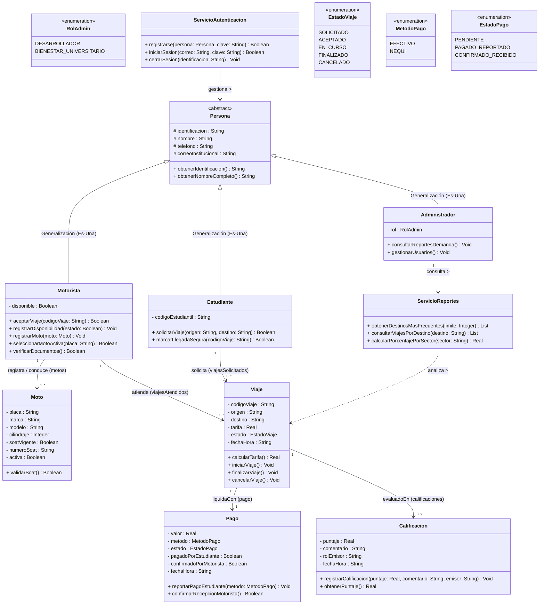

# TucanGo — Diagrama y Modelo de Dominio UML v3.2

> **Contexto:** Modelo de Dominio Orientado a Objetos para el sistema de confianza y trazabilidad de movilidad estudiantil en el campus (**TucanGo**).
> **Evolución v3.1 → v3.2:** Multiplicidad de flota para `Motorista` (`1..*` motos registradas) con bandera de selección de moto activa (`activa`).

---

## 1. Decisiones Arquitectónicas y de Flota (v3.2)

| Módulo / Aspecto | Decisión Implementada en v3.2 | Justificación Académica & POO |
| :--- | :--- | :--- |
| **1. Multi-Moto por Motorista** | Multiplicidad `Motorista "1" --> "1..*" Moto`. Métodos `registrarMoto(moto: Moto)` y `seleccionarMotoActiva(placa: String)`. Atributo `- activa : Boolean` en `Moto`. | **Realismo del Dominio:** Un conductor registra al menos 1 moto principal, pero puede tener secundarias y alternar cuál conduce en el día. En Java se mapea como `ArrayList<Moto>`. |
| **2. Jerarquía `Persona` con RBAC** | `Persona` abstracta con tres subclases: `Estudiante`, `Motorista` y `Administrador` (`RolAdmin`: `DESARROLLADOR` o `BIENESTAR_UNIVERSITARIO`). | **Polimorfismo & Seguridad:** Control de Acceso Basado en Roles. |
| **3. Módulo Analítico (`ServicioReportes`)** | Métodos para consultar destinos más frecuentes y porcentajes por sector con acceso exclusivo para `Administrador`. | **SRP & Privacidad:** La inteligencia de movilidad se aísla de los usuarios comunes. |
| **4. Pagos Informados Mutuos** | `MetodoPago` (`EFECTIVO`, `NEQUI`) y banderas mutuas (`pagadoPorEstudiante`, `confirmadoPorMotorista`). Cero comprobantes. | Modela el acuerdo de confianza entre pares de la comunidad universitaria. |
| **5. Calificación Bidireccional** | `Viaje "1" --> "0..2" Calificacion` con puntaje decimal `Double` (`1.0` - `5.0`) y `rolEmisor`. | Reputación mutua y seguridad comunitaria. |

---

## 2. Diagrama de Clases UML v3.2 (Mermaid)

