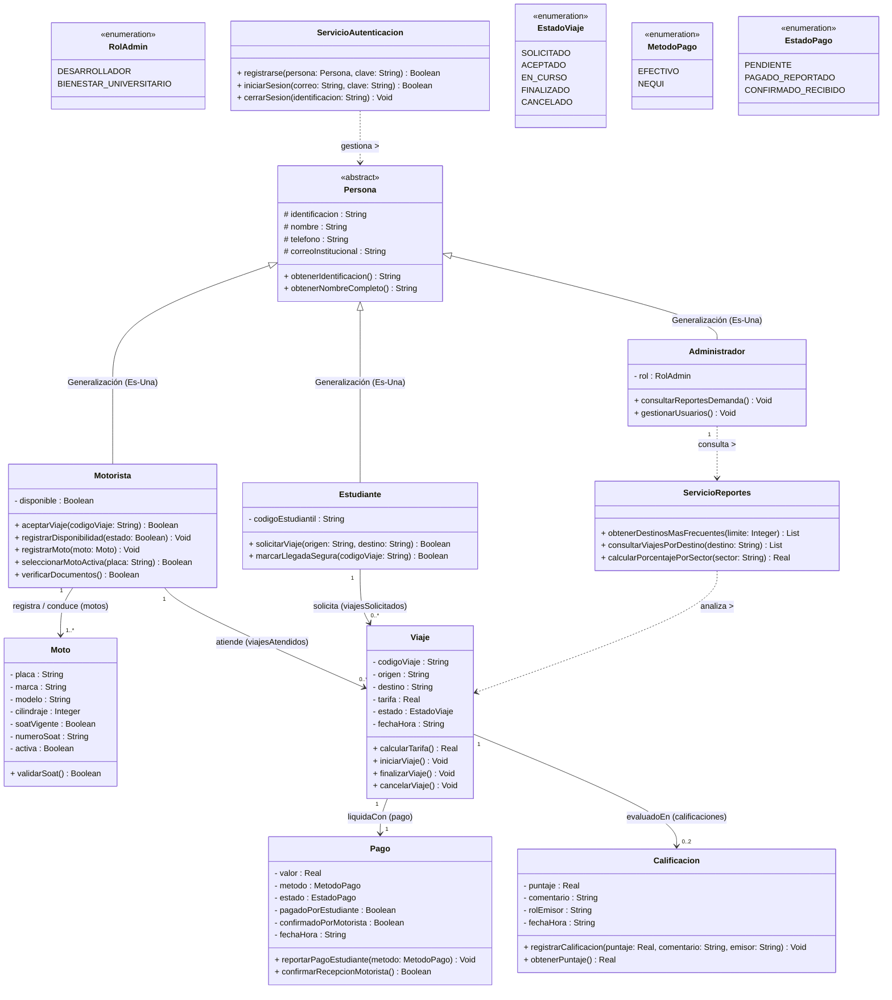

# TucanGo — Diagrama y Modelo de Dominio UML v5.0 (Definitivo)

> **Contexto:** Modelo de Dominio Orientado a Objetos para el sistema de confianza y trazabilidad de movilidad estudiantil en el campus (**TucanGo**).
> **Versión:** v5.0 (Consolidada y definitiva para entrega de Lógica y Algoritmos II - Universidad de la Amazonia).

---

## 1. Arquitectura Consolidada del Sistema

| Componente | Responsabilidad en el Dominio | Mapeo POO |
| :--- | :--- | :--- |
| **`Persona`** | Superclase abstracta con datos base del campus (`identificacion`, `nombre`, `telefono`, `correoInstitucional`). | Herencia (Generalización `Es-Una`). |
| **`Estudiante`** | Persona que solicita traslados seguros desde el campus hacia su destino. | Subclase con `- codigoEstudiantil`. |
| **`Motorista`** | Persona autorizada que atiende viajes y gestiona su flota de motocicletas. | Subclase con gestión de flota `1..*`. |
| **`Administrador`** | Personal autorizado (Desarrolladores / Bienestar Universitario) para auditar la demanda y seguridad del campus. | Subclase con `- rol : RolAdmin`. |
| **`Moto`** | Entidad de vehículo con atributos técnicos y regulatorios (`soatVigente`, `activa`). | Separación SRP de `Motorista`. |
| **`Viaje`** | Entidad central que coordina origen, destino, tarifa pactada y ciclo de vida transaccional. | Mapea relaciones con Pago y Calificación. |
| **`Pago`** | Mecanismo de reporte y confirmación mutua sin comprobante (`EFECTIVO` o `NEQUI`). | Estado mutuo de confianza entre pares. |
| **`Calificacion`** | Sistema de reputación bidireccional con puntuación decimal (`Double` 1.0 a 5.0). | Multiplicidad `0..2` por cada `Viaje`. |
| **`ServicioAutenticacion`** | Gestiona el registro y login seguro sin acoplar las entidades de dominio. | Capa de Servicio desacoplada. |
| **`ServicioReportes`** | Analiza destinos y zonas de mayor concurrencia con acceso restringido para `Administrador`. | Módulo de Inteligencia de Datos. |

---

## 2. Diagrama de Clases UML v5.0 (Mermaid)

